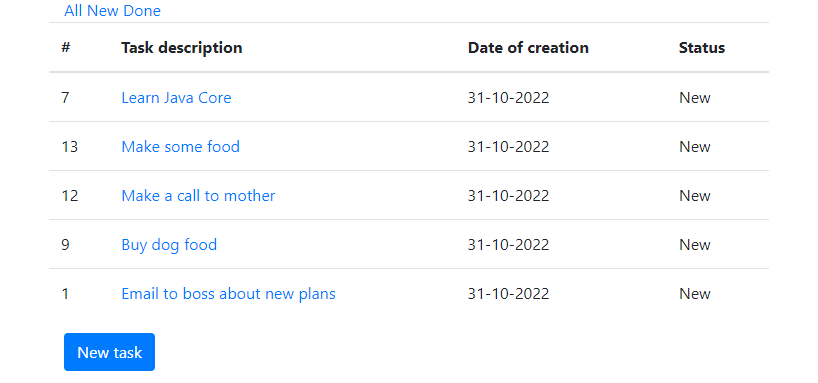
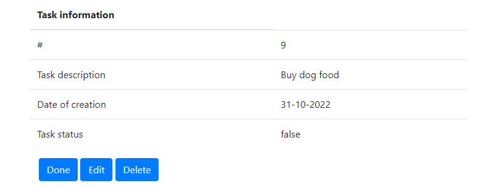
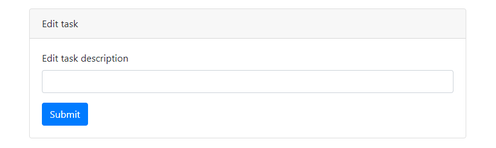

# job4j_todo

## О проекте
Это веб-приложение ToDo List.
Есть список заданий.

У каждого задания есть:
- идентификационный номер
- текстовое описание
- дата создания
- статус (выполнено/новое)

Пользователь может:
- фильтровать задания по статусу
- создавать новые задания
- менять описания
- отмечать задания выполненными.

В приложении создается один объект SessionFactory. Он загружается через Spring Context.
TaskStore принимает объект SessionFactory через конструктор.

## Использованные технологии
Java 17, Maven 4.0, Spring boot, PostgreSQL, Liquibase, Hibernate 5, Lombok, Thymeleaf, Bootstrap

## Настройка окружения
Установить PostgreSQL: логин - postgres, пароль - password
Создать там БД todo
Браузер желательно Chrome

## Запуск проекта
Запустить командой mvn spring-boot:run
перейти по ссылке http://localhost:8080/tasks